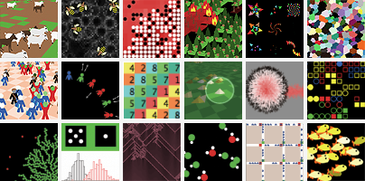

# {{title}}

**NetLogo** is a programmable modeling environment for simulating natural and
social phenomena. It was authored by Uri Wilensky in 1999 and has been in
continuous development ever since at the Center for Connected Learning and
Computer-Based Modeling.

**NetLogo** is particularly well suited for modeling complex systems developing
over time. Modelers can give instructions to hundreds or thousands of "agents"
all operating independently. This makes it possible to explore the connection
between the micro-level behavior of individuals and the macro-level patterns
that emerge from their interaction.

**NetLogo** lets students open simulations and "play" with them, exploring their
behavior under various conditions. It is also an authoring environment which
enables students, teachers and curriculum developers to create their own models.
NetLogo is simple enough for students and teachers, yet advanced enough to serve
as a powerful tool for researchers in many fields.

**NetLogo** has extensive documentation and tutorials. It also comes with the
Models Library, a large collection of pre-written simulations that can be used
and modified. These simulations address content areas in the natural and social
sciences including biology and medicine, physics and chemistry, mathematics and
computer science, and economics and social psychology. Several model-based
inquiry curricula using NetLogo are available and more are under development.

**NetLogo** is the next generation of the series of multi-agent modeling
languages including StarLogo and StarLogoT. NetLogo runs on the Java Virtual
Machine, so it works on all major platforms (Mac, Windows, Linux, et al). It is
run as a desktop application. Command line operation is also supported.

## Features

- System:
  - Free, [open source](https://github.com/NetLogo/NetLogo)
  - Cross-platform: runs on Mac, Windows, Linux, et al
  - International character set support
- Programming:
  - Fully programmable
  - Approachable syntax
  - Language is Logo dialect extended to support agents
  - Mobile agents (turtles) move over a grid of stationary agents (patches)
  - Link agents connect turtles to make networks, graphs, and aggregates
  - Large vocabulary of built-in language primitives
  - Double precision floating point math
  - First-class function values (aka anonymous procedures, closures, lambda)
  - Runs are reproducible cross-platform
- Environment:
  - Command center for on-the-fly interaction
  - Interface builder w/ buttons, sliders, switches, choosers, monitors, text
    boxes, notes, output area
  - Info tab for annotating your model with formatted text and images
  - HubNet: participatory simulations using networked devices
  - Agent monitors for inspecting and controlling agents
  - Export and import functions (export data, save and restore state of model,
    make a movie)
  - BehaviorSpace, an open source tool used to collect data from multiple
    parallel runs of a model
  - System Dynamics Modeler
  - NetLogo 3D for modeling 3D worlds
  - Headless mode allows doing batch runs from the command line
- Display and visualization:
  - Line, bar, and scatter plots
  - Speed slider lets you fast forward your model or see it in slow motion
  - View your model in either 2D or 3D
  - Scalable and rotatable vector shapes
  - Turtle and patch labels
- APIs:
  - controlling API allows embedding NetLogo in a script or application
  - extensions API allows adding new commands and reporters to the NetLogo
    language; open source example extensions are included

## What is Agent-Based Modeling?

Agent-based modeling is a powerful technique for understanding complex systems. In an
agent-based model, individual entities called "agents" operate according to simple rules.
These agents interact with each other and their environment, leading to the emergence of
complex behaviors and patterns at the system level. Agent-based modeling is widely used
in fields such as social sciences, biology, economics, and ecology to study phenomena like
population dynamics, market behavior, and social interactions.

### Why is NetLogo Useful for Agent-Based Modeling?

NetLogo is specifically designed for building and simulating agent-based models. Its
user-friendly interface and approachable programming language make it accessible to
both beginners and experienced modelers. NetLogo provides a rich set of built-in features
that facilitate the creation of complex models, including support for mobile agents,
networked interactions, and data collection. Additionally, NetLogo's extensive documentation
and active user community provide valuable resources for learning and collaboration in
the field of agent-based modeling.
